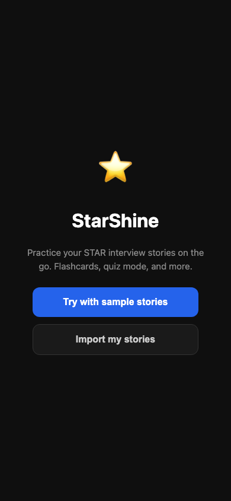
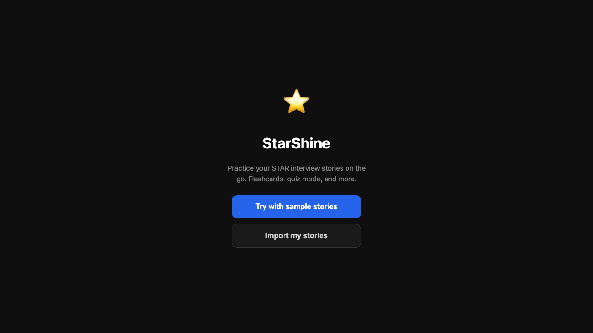
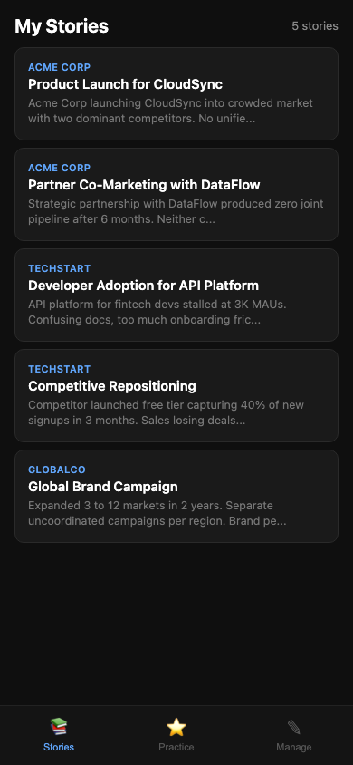
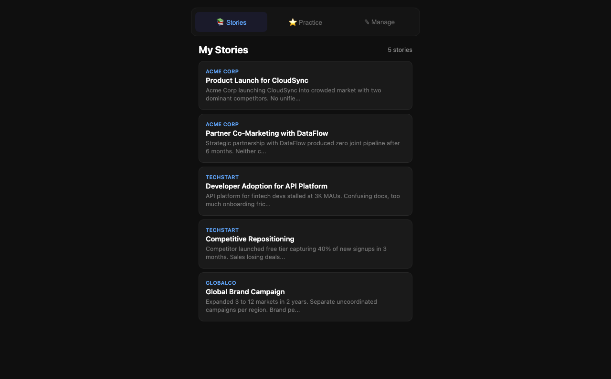
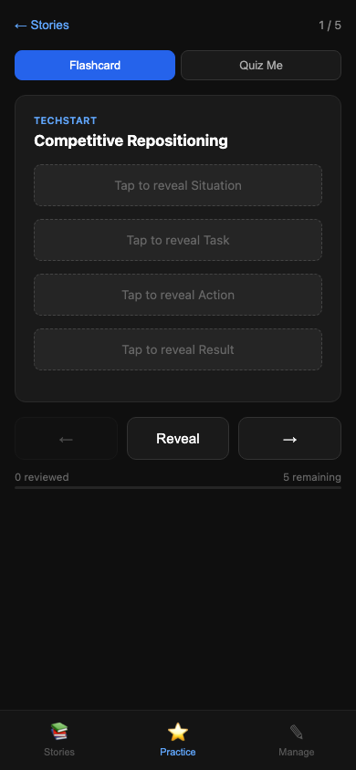
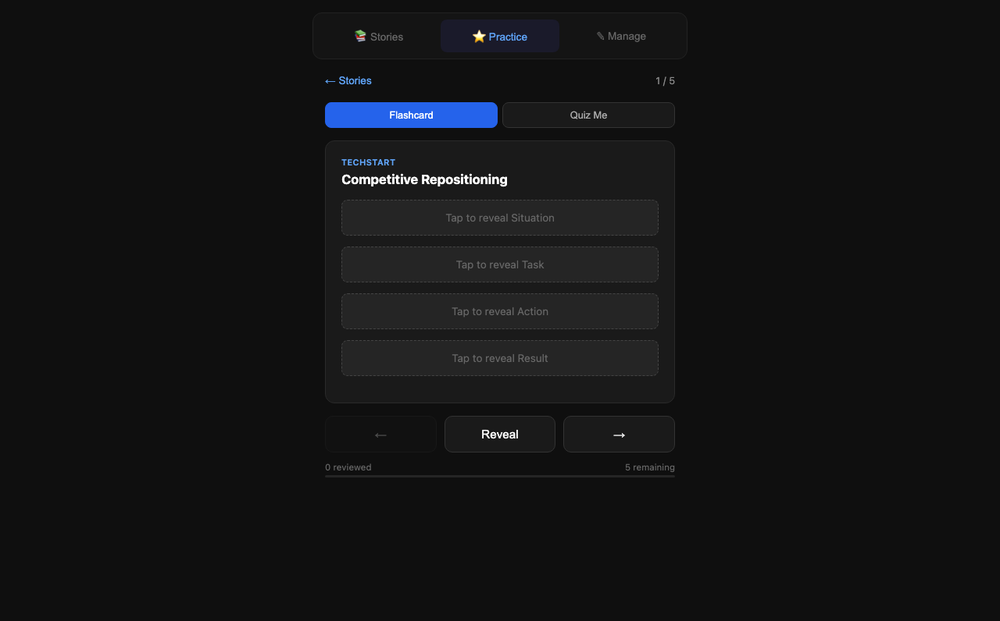
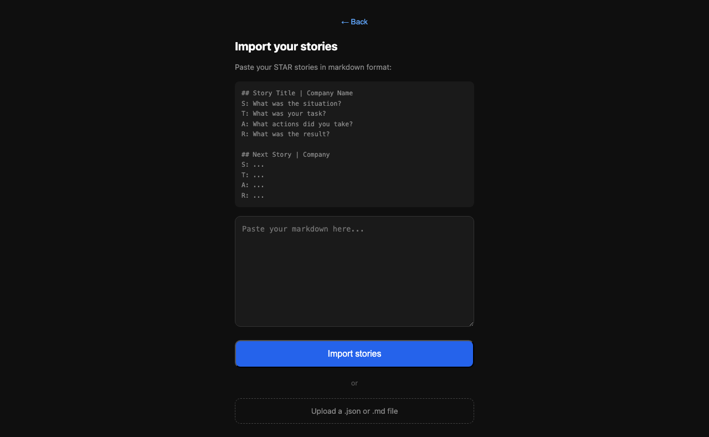
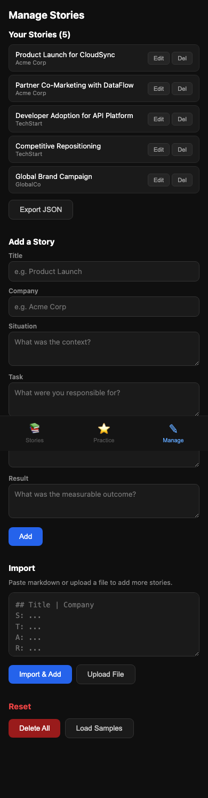

# StarShine

**When you're preparing for a behavioral interview**, you want to **practice recalling your STAR stories from memory** so you can **deliver them confidently without reading from notes.**

StarShine is a free, open-source flashcard app built for exactly this. Paste your stories in, practice on the go, and walk into your interview ready.

https://github.com/rkrevolution/StarShine/raw/main/starshine-demo.mp4

## What problems does it solve?

- **"I have a huge doc of STAR stories but can't memorize them"** — Flashcard mode forces active recall instead of passive reading
- **"I want to practice on my phone between meetings"** — Mobile-first, works offline, add to home screen
- **"I don't want to type stories one by one into a flashcard app"** — Paste a markdown file and you're done
- **"I need to test myself, not just review"** — Quiz mode shows the Situation and makes you recall the rest

## How it works

### 1. Open the app — no signup, no account

Choose to explore with sample stories or import your own right away.

| Mobile | Desktop |
|--------|---------|
|  |  |

### 2. Browse your stories

All your STAR stories in a clean list. Tap any story to start practicing.

| Mobile | Desktop |
|--------|---------|
|  |  |

### 3. Practice with flashcards or quiz yourself

**Flashcard mode** — tap to progressively reveal Situation, Task, Action, Result.
**Quiz mode** — see the Situation, try to recall the rest from memory before revealing.

| Mobile | Desktop |
|--------|---------|
|  |  |

### 4. Import your stories in seconds

Paste a markdown file or upload a `.json` / `.md` file. No typing stories one by one.



### 5. Manage your library

Add, edit, delete stories. Export JSON to move between devices. All from the Manage tab.



## Features

- **Flashcards** — Tap to progressively reveal S, T, A, R
- **Quiz Mode** — See the Situation, recall the rest before checking
- **Progress Tracking** — Reviewed count, remaining count, progress bar
- **Import from Markdown** — Paste a doc to bulk-add stories
- **Add/Edit/Delete** — Full CRUD for managing stories
- **Export/Import JSON** — Move stories between devices
- **Mobile-first** — Bottom nav on mobile, top nav on desktop
- **Works offline** — No server, no accounts, no dependencies
- **Zero setup** — Single HTML file, no build tools, no frameworks

## Markdown Import Format

```markdown
## Story Title | Company Name
S: What was the situation?
T: What was your task?
A: What actions did you take?
R: What was the result?

## Another Story | Another Company
S: ...
T: ...
A: ...
R: ...
```

## Deploy Your Own

**GitHub Pages (recommended):**
1. Fork this repo
2. Go to Settings → Pages → Source: `main` branch, root `/`
3. Your site is live at `https://<username>.github.io/StarShine/`

**Or just open the file locally:**
```bash
open index.html
```

## Dev/Testing

Add URL params for quick testing:
- `?reset` — Clear all data, show welcome screen
- `?screen=home` — Jump to story list
- `?screen=practice` — Jump to practice view
- `?screen=manage` — Jump to manage screen
- `?screen=import` — Jump to import screen

## Files

```
StarShine/
  index.html              # The entire app
  apple-touch-icon.png    # Star icon for iOS home screen
  screenshots/            # App screenshots for README
  README.md               # This file
```

## License

MIT
